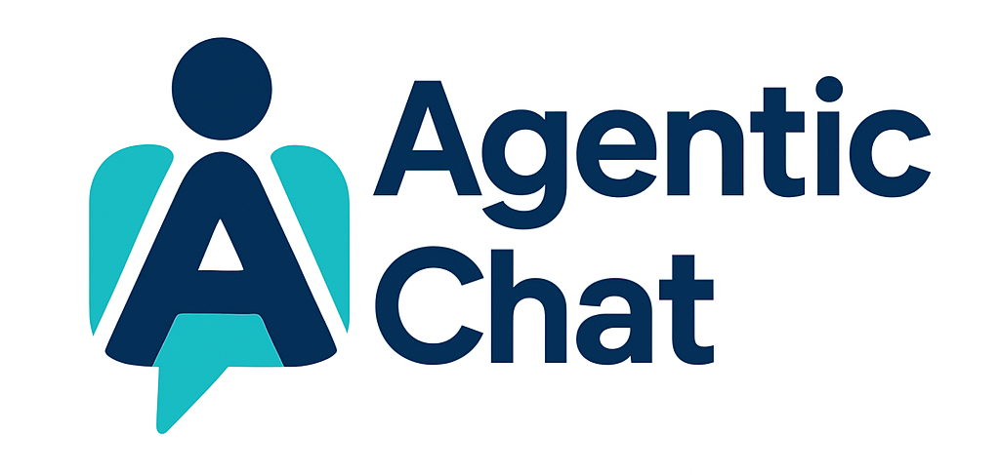

# 🤖 Agentic-Chat

  

## 🧠 Introduction

**Agentic-Chat** is a **secure, modular, and intelligent multi-agent chat system** designed to bring together multiple specialized agents under one unified framework. It enables **real-time collaboration**, **context-aware reasoning**, and **protocol-based communication** among agents to handle complex, multi-domain tasks.

Built with **FastAPI**, **JWT**, **LangGraph**, **MongoDB**, **Redis**, and **A2A**, **MCP** and **AG_UI** Protocols, it ensures **stateful**, **secure**, and **scalable** conversational AI operations.

---

## 🔷 Name & Meaning

**Name:** Agentic-Chat  

- **Agentic**: Autonomous, intelligent action  
- **Chat**: Interactive conversational interface  

Represents a multi-agent platform where commands trigger coordinated actions across specialized agents.

---

## 📌 Why Agentic-Chat?

- 🔒 **Secure** → Guardrails & intent filtering  
- ⚡ **Modular & Extensible** → Plug new agents easily  
- 🔗 **Protocol-driven** → (A2A + MCP + AG_UI)  
- 🧠 **Multi-agent orchestration** → Handles complex tasks by combining agent strengths  
---